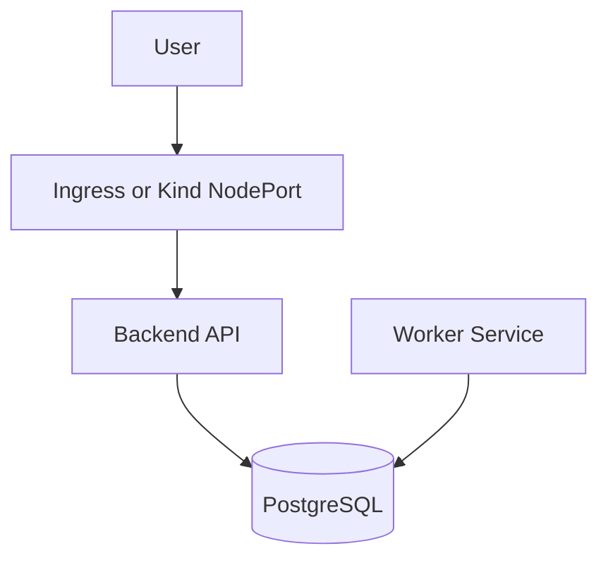

# TaskForge

TaskForge is a production-style DevOps infrastructure challenge project.

Application purpose:

```text
User creates work items -> Backend stores them in PostgreSQL -> Worker processes them from PostgreSQL
```

Infrastructure purpose:

- run two microservices: `backend` and `worker`
- run one dependency: PostgreSQL
- deploy to local Kubernetes using Kind
- use raw Kubernetes YAML and `kubectl`
- demonstrate CI/CD using Azure DevOps pipeline YAML
- demonstrate readiness/liveness probes
- simulate and debug a real DB connectivity failure

No AKS/EKS/GKE is required. No one-click platforms are used. Kubernetes details
are intentionally visible.

## Architecture



## Repository Structure

```bash
TaskForge/
  apps/
    backend/
    worker/
  infra/
    kind/
    k8s/
  pipelines/
    Infra-Pipelines/
    Master-Pipelines/
    Service-CI/
    Service-CD/
  docs/
  scripts/
  docker-compose.yml
```

## How to Run End-to-End

From VS Code terminal:

```bash
cd /Users/riteshvishwakarma/Downloads/project/TaskForge
```

Install local tools:

```bash
brew install kind kubectl
```

Run locally with Docker Compose:

```bash
docker compose up --build
```

Verify local app:

```bash
curl http://127.0.0.1:8000/health
curl http://127.0.0.1:8000/ready
curl -X POST http://127.0.0.1:8000/items \
  -H "Content-Type: application/json" \
  -d '{"title":"local-item","description":"created with docker compose"}'
curl http://127.0.0.1:8000/items
```

Stop local app:

```bash
docker compose down
```

Deploy to Kind:

```bash
./scripts/deploy.sh
```

Verify Kubernetes deployment:

```bash
kubectl -n devops-challenge get pods -o wide
kubectl -n devops-challenge get svc
kubectl -n devops-challenge get deployments
kubectl -n devops-challenge get pvc
curl http://127.0.0.1:8080/health
curl http://127.0.0.1:8080/ready
curl -X POST http://127.0.0.1:8080/items \
  -H "Content-Type: application/json" \
  -d '{"title":"kind-item","description":"created in kind"}'
curl http://127.0.0.1:8080/items
```

Run failure demo:

```bash
./scripts/simulate-failure.sh
./scripts/debug.sh
./scripts/fix-failure.sh
curl http://127.0.0.1:8080/ready
```

## Main Docs

- Full execution guide: [docs/execution-guide.md](/Users/riteshvishwakarma/Downloads/project/TaskForge/docs/execution-guide.md)
- Command cheat sheet: [docs/demo-command-cheatsheet.md](/Users/riteshvishwakarma/Downloads/project/TaskForge/docs/demo-command-cheatsheet.md)
- Video script: [docs/video-script.md](/Users/riteshvishwakarma/Downloads/project/TaskForge/docs/video-script.md)
- Proposal: [docs/proposal.md](/Users/riteshvishwakarma/Downloads/project/TaskForge/docs/proposal.md)
