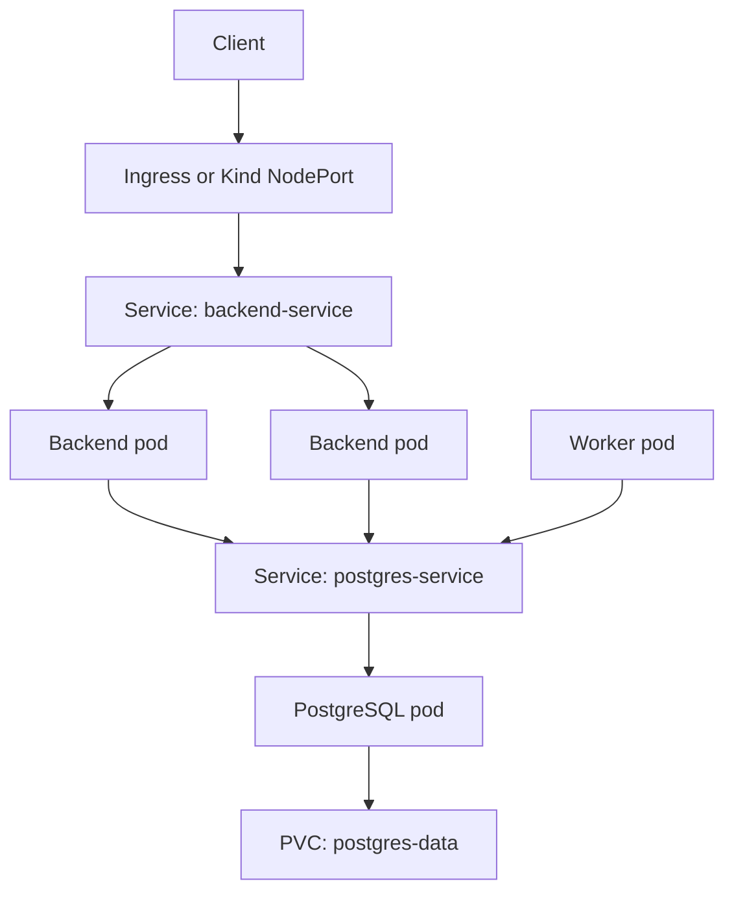

# Architecture Walkthrough

## System Components

TaskForge has two microservices and one dependency.

- Backend API: FastAPI service that exposes `/items`, `/health`, and `/ready`.
- Worker service: FastAPI service that periodically processes rows from PostgreSQL.
- PostgreSQL: stateful database with a Kubernetes PersistentVolumeClaim.

## Runtime Architecture



## Kubernetes Objects

Raw Kubernetes YAML is stored under `infra/k8s/`.

- `namespace.yaml`: creates `devops-challenge`.
- `configmap.yaml`: stores non-sensitive runtime config.
- `secret.yaml`: stores demo PostgreSQL credentials.
- `postgres.yaml`: creates PVC, Deployment, and Service.
- `backend-deployment.yaml`: backend replicas, probes, resources, env vars.
- `backend-service.yaml`: NodePort Service for local Kind access.
- `worker-deployment.yaml`: worker service with probes and resources.
- `worker-service.yaml`: internal Service for worker health access.
- `ingress.yaml`: explicit ingress object for environments with an ingress controller.

## Deployment Flow

```text
Docker build -> kind load image -> kubectl apply -f infra/k8s/ -> rollout status
```

CI/CD flow:

```text
Code push -> tests -> Docker build -> registry push -> kubectl apply -> verify
```

## Why This Structure

This keeps the challenge clean: two services prove microservice deployment, and
one PostgreSQL dependency is enough to demonstrate configuration, storage,
service discovery, readiness probes, and debugging.
