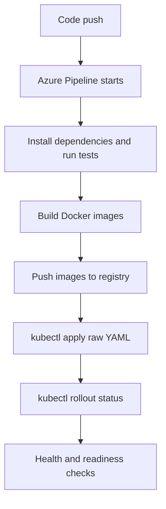

# TaskForge Proposal

## Project Summary

TaskForge is a minimal production-style task processing platform deployed on
Kubernetes. The application has two microservices and one dependency:

- Backend API: receives task creation and listing requests.
- Worker service: processes unprocessed tasks asynchronously.
- PostgreSQL: persistent database dependency.

The application is deliberately simple. The challenge evaluates infrastructure
engineering, not feature complexity.

## Goal

Build and deploy an end-to-end Kubernetes application stack that demonstrates:

- containerization
- deployment automation
- CI/CD pipeline design
- Kubernetes object knowledge
- observability
- readiness and liveness probes
- operational debugging
- production tradeoff reasoning

## Cluster Setup

The project uses Kind because it is free, local, fast, and exposes Kubernetes
concepts without hiding infrastructure behind a managed platform.

The Kind cluster is created from:

```bash
infra/kind/kind-cluster.yaml
```

The application runs in namespace:

```bash
devops-challenge
```

## Deployment Flow



## Reliability Decision

The real reliability improvement is readiness and liveness probes:

- `/health` proves the process is alive.
- `/ready` proves the service can reach PostgreSQL.

This is market-relevant because many incidents happen when a container is
running but the application is not ready for traffic.

## Failure Scenario

The intentional failure is a bad database hostname:

```bash
DB_HOST=wrong-postgres
```

The real value of this failure is that it creates a strong debugging story:

1. Pods are running.
2. Readiness fails.
3. Logs show database connection errors.
4. ConfigMap contains an incorrect database host.
5. Kubernetes Service is actually named `postgres-service`.
6. Restoring `DB_HOST=postgres-service` recovers the rollout.
